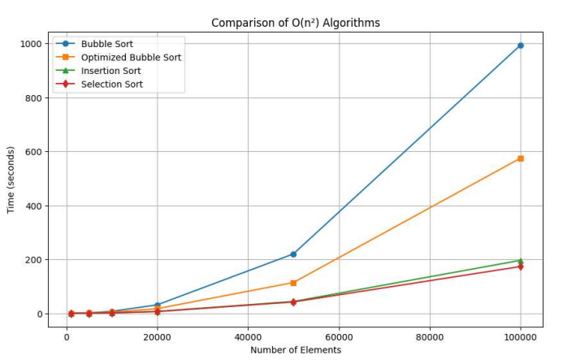
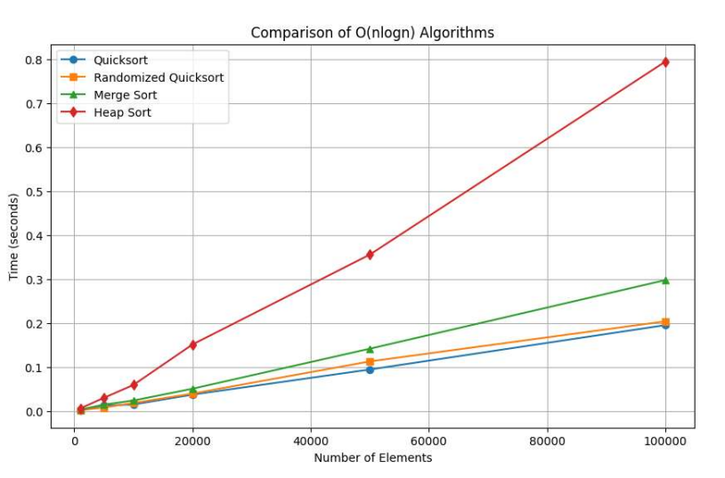
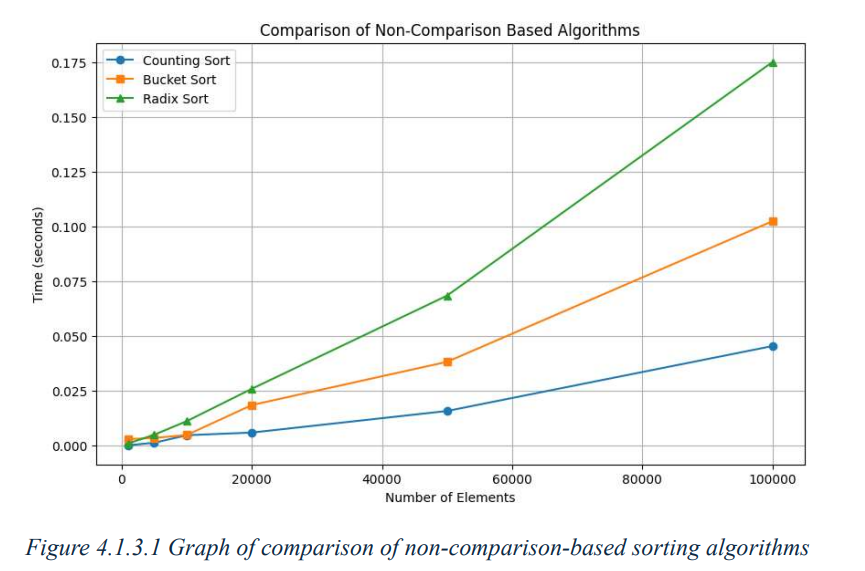

# Comparative Analysis of Sorting Algorithms
A comprehensive benchmarking project that analyzes the performance, time complexity, and stability of various sorting algorithms using Python.

## Project Overview
Sorting is a fundamental operation in computer science. This project evaluates **10 different sorting algorithms**, covering both comparison-based and non-comparison-based techniques. The goal is to determine the optimal algorithm for specific real-world edge cases based on dataset sizes ranging from **1,000 to 100,000 elements**.

## Technologies Used
*   **Language:** Python
*   **Environment:** Jupyter Notebook
*   **Libraries:** Matplotlib (for data visualization), NumPy

## Algorithms Analyzed
### Comparison-Based Algorithms
*   **O(n²) Algorithms:** Bubble Sort, Insertion Sort, Selection Sort
*   **O(n log n) Algorithms:** Quick Sort, Merge Sort, Heap Sort

### Non-Comparison-Based Algorithms
*   Counting Sort, Radix Sort, Bucket Sort

## Performance Graphs & Visualizations
Below are the empirical performance comparison graphs generated from the Jupyter notebooks:

### 1. O(n²) Algorithms Comparison

### 2. O(n log n) Algorithms Comparison

### 3. Non-Comparison-Based Algorithms Comparison

